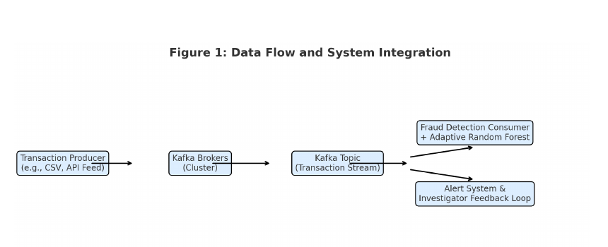
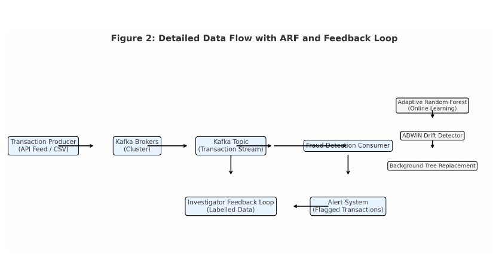
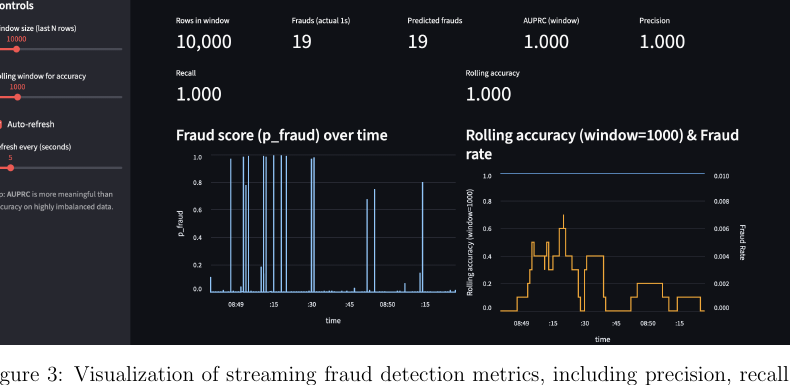

# Real-Time Fraud Detection

A real-time credit-card fraud detection pipeline built with Apache Kafka, scikit-learn, River ADWIN and Streamlit.

This repository is a portfolio version of the MSc Data Analytics Research Practicum project **Hybrid Real-Time Fraud Detection in Finance**.

## Project overview

The system simulates financial transactions as a live stream and evaluates them for fraud in real time.

```text
creditcard.csv
      |
      v
Kafka Producer
      |
      v
transaction_topic
      |
      v
Kafka Consumer
      |
      +-----------------------------+
      |                             |
      v                             v
Random Forest scoring          ADWIN monitoring
      |                             |
      v                             v
Fraud alerts                  Drift events
      \                             /
       \                           /
        +---- Runtime outputs -----+
                    |
                    v
             Streamlit dashboard
```

## Recovered implementation

The repository contains recovered project code for:

- model training
- Kafka transaction production
- Kafka fraud scoring
- ADWIN drift monitoring
- precision, recall, F1 and AUPRC tracking
- fraud alert publishing
- latency and throughput logging
- Streamlit monitoring
- shell-based startup orchestration

## Technology stack

- Python
- Apache Kafka
- scikit-learn
- River / ADWIN
- pandas
- NumPy
- Streamlit
- Altair
- joblib

## Repository structure

```text
.
├── src/
│   ├── train_model.py
│   ├── kafka_producer.py
│   └── kafka_consumer.py
├── dashboard/
│   └── app.py
├── scripts/
│   └── start_all.sh
├── data/
│   └── README.md
├── outputs/
│   ├── README.md
│   ├── kafka_alerts.csv
│   ├── kafka_drift_log.csv
│   └── kafka_perf.csv
├── docs/
│   └── IMPLEMENTATION_NOTES.md
├── requirements.txt
├── .gitignore
└── README.md
```

## Model training

The recovered training script fits a `StandardScaler` and a `RandomForestClassifier` configured with:

- `n_estimators=200`
- `class_weight='balanced_subsample'`
- `random_state=42`
- `n_jobs=-1`

Run:

```bash
python src/train_model.py
```

This creates:

```text
scaler.joblib
rf_model.joblib
```

The model binaries are excluded from Git because they can be recreated from the training script.

## Kafka producer

The producer:

1. loads `creditcard.csv`
2. validates the expected feature columns
3. streams rows in their original order
4. publishes to `transaction_topic`
5. includes a `send_ts` value for latency measurement

Run:

```bash
python src/kafka_producer.py
```

## Kafka consumer

The main recovered consumer:

- loads the trained Random Forest and scaler
- receives transactions from `transaction_topic`
- computes fraud probabilities
- applies a `0.20` fraud decision threshold
- emits predicted frauds to the Kafka `alerts` topic
- monitors correctness with ADWIN
- tracks precision, recall, F1 and AUPRC
- writes transaction-level results for the dashboard

Run:

```bash
python src/kafka_consumer.py
```

## Dashboard

The recovered Streamlit dashboard displays:

- rows processed
- actual frauds
- predicted frauds
- AUPRC
- precision
- recall
- rolling accuracy
- fraud scores over time
- fraud rate
- recent fraud alerts
- detected drift events

Run:

```bash
streamlit run dashboard/app.py
```

## Installation

```bash
python -m venv .venv
source .venv/bin/activate
pip install -r requirements.txt
```

Kafka should be available locally at:

```text
localhost:9092
```

A typical run order is:

```bash
python src/train_model.py
python src/kafka_consumer.py
python src/kafka_producer.py
streamlit run dashboard/app.py
```

The recovered `scripts/start_all.sh` documents the original macOS startup sequence using Docker/Kafka, followed by the consumer, producer and Streamlit dashboard.

## Project Architecture

The system uses Apache Kafka to simulate a real-time transaction stream, with machine learning used to score incoming transactions for fraud and ADWIN used to monitor changes in the data stream.

### System Architecture



### Adaptive Random Forest and Concept Drift

The original MSc research design incorporated Adaptive Random Forest with ADWIN-based concept drift detection and a feedback loop for adapting to changing fraud patterns.



## Dashboard

A Streamlit dashboard was developed to monitor fraud detection performance and transaction activity in real time.


## Dataset

The implementation uses the credit-card fraud dataset with:

- `Time`
- PCA features `V1`–`V28`
- `Amount`
- fraud label `Class`

The dataset itself is not included in the repository. See [`data/README.md`](data/README.md).

## Research and implementation distinction

The MSc research report discusses adaptive fraud detection and Adaptive Random Forest.

The recovered executable implementation published here uses a **batch-trained scikit-learn Random Forest for fraud scoring plus ADWIN for drift monitoring**. Another recovered development variant used River's Hoeffding Tree with online `learn_one()` updates.

These are documented as distinct development variants rather than being presented as the same algorithm.

## Portfolio publication note

This repository has been cleaned for public portfolio use:

- large datasets are excluded
- generated model binaries are excluded
- runtime outputs are separated from source code
- recovered source files are preserved
- the research-report/implementation distinction is documented explicitly

## Academic context

**Project:** Hybrid Real-Time Fraud Detection in Finance  
**Module:** Research Practicum  
**Programme:** MSc Data Analytics  
**Institution:** National College of Ireland

## License

MIT
